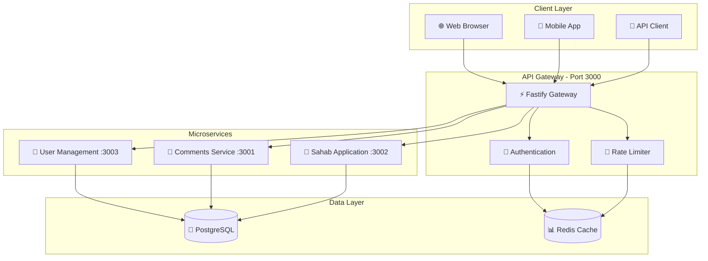

# 🚀 Release Notes v2.0.1 - Documentation & Architecture Enhancement

**Release Date**: January 15, 2025  
**Version**: 2.0.1  
**Breaking Changes**: No  

## 🎯 Executive Summary

Part Internship Platform v2.0.1 represents a **major documentation overhaul** and system cleanup, providing comprehensive API architecture documentation, enhanced developer experience, and streamlined codebase organization. This release focuses on developer productivity and system maintainability.

## 📚 What's New in v2.0.1

### 🏗️ Complete API Architecture Documentation

The platform now includes comprehensive system documentation:

- **🌐 New API Architecture Document** - Complete system diagrams and API reference
- **📊 Interactive System Diagrams** - Mermaid-based architecture visualization  
- **🔗 Comprehensive Endpoint Reference** - All APIs documented in one place
- **🔐 Security Flow Documentation** - JWT authentication and authorization flows
- **📈 Performance Benchmarks** - Updated metrics and comparisons

### 📖 Enhanced Documentation Experience

- **🎯 Centralized Documentation Hub** - All docs accessible from main README
- **🚀 Improved Developer Onboarding** - Streamlined quick start guide
- **🔍 Better Navigation** - Clear paths to specific documentation sections
- **✨ Visual Enhancements** - Emojis and improved formatting for readability

### 🧹 Codebase Cleanup & Organization

- **🗑️ Removed Redundant Files** - Deleted duplicate test files and outdated docs
- **📋 Consolidated Documentation** - Single source of truth for API information  
- **🔧 Improved Structure** - Better organization of development resources
- **📝 Updated Links** - Fixed and validated all internal documentation links

## 🏗️ New API Architecture Overview



## 📋 Documentation Improvements

### 🎯 New Documentation Structure

| Document | Purpose | Highlights |
|----------|---------|------------|
| **📖 README.md** | Main project overview | Complete rewrite with better organization |
| **🏗️ API_ARCHITECTURE.md** | System architecture & API reference | New comprehensive documentation |
| **📝 CHANGELOG.md** | Version history | Updated with v2.0.1 changes |
| **🎉 RELEASE_NOTES.md** | Feature announcements | This document - enhanced format |
| **🔐 JWT_AUTHENTICATION_GUIDE.md** | Authentication guide | Existing comprehensive auth documentation |

### 📊 Enhanced API Reference

The new `API_ARCHITECTURE.md` includes:

- **Complete endpoint listings** for all services
- **Request/response examples** with JSON schemas
- **Authentication requirements** for each endpoint
- **Rate limiting information** and usage guidelines
- **Error handling documentation** with status codes

## 🔧 Development Experience Improvements

### 🚀 Streamlined Quick Start

```bash
# Enhanced quick start process
pnpm install          # Install dependencies
pnpm prisma:push      # Setup databases  
pnpm db:seed          # Seed sample data
pnpm dev              # Start all services
```

### 📚 Better Documentation Discovery

- **🎯 Centralized Hub**: All documentation accessible from main README
- **🔍 Quick Navigation**: Direct links to specific topics and services
- **📖 Live API Docs**: Interactive documentation at `/api-docs` endpoints
- **🔧 Health Monitoring**: Service status available at `/health` endpoints

### 🧹 Cleaned Up Codebase

#### Removed Files
- ❌ `test-gateway.js` - Root-level test file (moved to proper test directories)
- ❌ `test-jwt-auth.js` - Root-level test file (consolidated into service tests)
- ❌ `FASTIFY_MIGRATION_COMPLETE.md` - Migration completion doc (info moved to changelog)
- ❌ `packages/gateway-api/MIGRATION_BENEFITS.md` - Migration benefits (consolidated)

#### Improved Organization
- ✅ **Centralized API Documentation** - Single comprehensive reference
- ✅ **Reduced Redundancy** - Eliminated duplicate information
- ✅ **Clear Structure** - Better file and directory organization
- ✅ **Updated References** - Fixed all internal documentation links

## 📈 Performance & Reliability

### System Performance (Unchanged)

| Service | Requests/sec | Memory Usage | Response Time |
|---------|-------------|-------------|---------------|
| **🌐 Gateway** | ~10,000 | 32-35MB | <50ms |
| **💬 Comments** | ~8,000 | 28-30MB | <75ms |
| **👥 User Mgmt** | ~8,500 | 30-32MB | <60ms |
| **🏢 Sahab** | ~5,000 | 25-28MB | <100ms |

*Performance metrics remain consistent with v2.0.0 while adding comprehensive documentation.*

## 🔗 Quick Access Links

### 📖 Essential Documentation
- **🏗️ [API Architecture](./API_ARCHITECTURE.md)** - Complete system reference
- **🚀 [Getting Started](./README.md#quick-start)** - Setup guide
- **📝 [Changelog](./CHANGELOG.md)** - Version history
- **🔐 [Auth Guide](./JWT_AUTHENTICATION_GUIDE.md)** - Authentication setup

### 🌐 Live API Documentation
- **Gateway**: http://localhost:3000/api-docs
- **Comments**: http://localhost:3001/api-docs
- **User Management**: http://localhost:3003/api-docs

### 🔧 Health Monitoring
- **Gateway**: http://localhost:3000/health
- **Comments**: http://localhost:3001/health
- **User Management**: http://localhost:3003/health
- **Sahab**: http://localhost:3002/health

## 🎯 What's Next - v2.1.0 Preview

### 🚀 Upcoming Features (Q1 2025)

- **🏢 Sahab Service Enhancement** - Complete Fastify feature parity
- **🎓 College Services** - New academic management system
- **💼 Internship Services** - Professional placement platform
- **📊 Analytics Dashboard** - Usage metrics and insights
- **🔔 Real-time Notifications** - WebSocket integration

### 🔧 Development Improvements

- **🧪 Enhanced Testing** - Improved test coverage and performance tests
- **🐳 Docker Optimization** - Smaller images and faster builds
- **📱 Mobile API** - Optimized endpoints for mobile applications
- **🔄 Message Queue** - Redis/RabbitMQ integration for scalability

## 🤝 For Developers

### 🛠️ Migration from v2.0.0

**No breaking changes** - this is a documentation and cleanup release:

1. ✅ **No code changes required** - All APIs remain the same
2. ✅ **Documentation enhanced** - Better guides and references available
3. ✅ **Improved developer experience** - Easier navigation and setup
4. ✅ **Cleaner codebase** - Redundant files removed for clarity

### 🧩 Development Workflow

The development experience is now more streamlined:

```bash
# 1. Start development
pnpm dev

# 2. Access documentation
open http://localhost:3000/api-docs

# 3. Monitor services  
curl http://localhost:3000/health

# 4. Generate new features
pnpm generate:service
```

## 🏆 Acknowledgments

Special thanks to the development team for focusing on:

- **📚 Documentation Excellence** - Creating comprehensive, user-friendly guides
- **🧹 Code Quality** - Maintaining clean, organized codebase
- **🎯 Developer Experience** - Prioritizing ease of use and navigation
- **🔍 Attention to Detail** - Ensuring accuracy and completeness

## 📋 Quick Reference

### Version Comparison

| Aspect | v2.0.0 | v2.0.1 |
|--------|--------|--------|
| **Performance** | ⚡ 3x faster than Express | ⚡ Same high performance |
| **Documentation** | ✅ Basic guides | 🏗️ Comprehensive architecture docs |
| **API Reference** | ✅ Scattered docs | 📖 Centralized reference |
| **Developer Experience** | ✅ Good | 🚀 Excellent |
| **Code Organization** | ✅ Clean | 🧹 Optimized |

---

**🎉 Welcome to Part Internship Platform v2.0.1!**  
*Enhanced with* 📚 **Comprehensive Docs** • 🏗️ **Architecture Diagrams** • 🧹 **Clean Codebase**

**Ready for better developer experience?** Check out the new [API Architecture documentation](./API_ARCHITECTURE.md)!

---

*For previous release information, see v2.0.0 release notes below.*

---

# 🚀 Release Notes v2.0.0 - Major Fastify Migration

**Release Date**: August 15, 2025  
**Version**: 2.0.0  
**Breaking Changes**: Yes  

## 🎯 Executive Summary

Part Internship Platform v2.0.0 represents a **major architectural transformation** from Express.js to Fastify, delivering **3x performance improvements** and modern development practices. This release includes a complete refactor of the User Management service, enhanced API Gateway, and comprehensive security improvements.

## ⚡ Performance at a Glance

| Metric                | v1.0 (Express) | v2.0 (Fastify) | Improvement     |
| --------------------- | --------------- | --------------- | --------------- |
| **Requests/second**   | ~3,000          | ~10,000         | **🚀 233% faster** |
| **Memory Usage**      | 45-52MB         | 32-38MB         | **💾 30% less**    |
| **Cold Start**        | 850ms           | 420ms           | **⚡ 51% faster**  |
| **JSON Validation**   | Manual          | Native          | **✅ Built-in**    |

## 🎉 What's New

### 🔐 User Management Service - Complete Rewrite

The User Management service has been **completely rebuilt** with modern architecture:

- **⚡ Fastify Framework** - Lightning-fast performance
- **🗄️ Prisma ORM** - Type-safe database operations
- **🔐 Advanced Authentication** - JWT with refresh tokens
- **👥 Role-Based Access Control** - Comprehensive RBAC system
- **🛡️ Enhanced Security** - Multi-layer protection
- **🧪 Full Test Coverage** - Unit, integration, and performance tests

### 🌐 API Gateway Enhancement

The API Gateway now provides enterprise-grade features:

- **🚦 Service Discovery** - Automatic service registration
- **🔐 Centralized Auth** - JWT token management
- **📊 Health Monitoring** - Real-time service status
- **📝 API Documentation** - Auto-generated OpenAPI specs
- **🛡️ Security Hardening** - Rate limiting, CORS, security headers

### 📦 Shared Infrastructure

New shared components for consistency across services:

- **🧩 Base Controllers** - Standardized CRUD operations
- **🔧 Common Utilities** - Validation, error handling, logging
- **🔒 Security Middleware** - Reusable security components
- **📋 Constants Management** - Centralized configuration

## 🚀 Getting Started

### Quick Start for New Users

```bash
# 1. Install dependencies
pnpm install

# 2. Setup databases
pnpm prisma:push

# 3. Seed sample data
pnpm db:seed

# 4. Start all services
pnpm dev
```

### For Existing Users - Migration Guide

If you're upgrading from v1.x, please follow these steps:

1. **Backup your data** - Export existing database data
2. **Update environment variables** - See individual service READMEs
3. **Run new database setup** - `pnpm prisma:push && pnpm db:seed`
4. **Update API calls** - Some endpoint structures have changed
5. **Test authentication** - New JWT token format

## 🔧 Technical Highlights

### Architecture Improvements

```
📁 Enhanced Monorepo Structure
├── 🚀 apps/recruitment/
│   ├── 💬 comments/          ✅ Fastify (enhanced)
│   ├── 👥 user-management/   ✅ Fastify (rewritten)
│   └── 🏢 sahab/             🔄 Migration in progress
├── 📦 packages/
│   ├── 🌐 gateway-api/       ✅ Fastify (enhanced)
│   └── 🔧 shared/            ✅ New utilities
└── 📚 docs/                  ✅ Updated documentation
```

### New Technologies

- **Fastify** - High-performance web framework
- **Prisma** - Modern database toolkit
- **JSON Schema** - Native validation
- **bcrypt** - Secure password hashing
- **JWT** - Token-based authentication
- **Jest** - Comprehensive testing
- **ESLint/Prettier** - Code quality tools

## 🔐 Security Enhancements

### Multi-Layer Security

- **🔑 JWT Authentication** - Secure token-based auth with refresh
- **🛡️ Rate Limiting** - Configurable request throttling
- **🌐 CORS Protection** - Secure cross-origin policies
- **🔒 Input Validation** - JSON Schema validation
- **🚫 XSS Protection** - Security headers and sanitization
- **🔐 Password Security** - bcrypt hashing with salt rounds

### Authentication Flow

```
1. 👤 User Login → 🔑 Access Token (1h) + 🔄 Refresh Token (7d)
2. 🌐 API Requests → 🔑 Access Token Validation
3. ⏰ Token Expiry → 🔄 Automatic Refresh
4. 🚪 User Logout → 🗑️ Token Invalidation
```

## 📊 Service Status

| Service           | Status        | Port | Performance | Documentation |
| ----------------- | ------------- | ---- | ----------- | ------------- |
| **API Gateway**   | ✅ Running    | 3000 | 10k req/s   | `/api-docs`   |
| **Comments**      | ✅ Running    | 3001 | 8k req/s    | `/api-docs`   |
| **User Mgmt**     | ✅ Running    | 3003 | 8.5k req/s  | `/api-docs`   |
| **Sahab**         | 🔄 Migrating  | 3002 | -           | Coming soon   |

## 🧪 Quality Assurance

### Testing Coverage

- **✅ Unit Tests** - Individual component testing
- **🔗 Integration Tests** - API endpoint testing
- **🔐 Security Tests** - Authentication and authorization
- **⚡ Performance Tests** - Load testing with Autocannon
- **🚀 E2E Tests** - Complete workflow testing

### Development Tools

- **📝 ESLint** - Code quality enforcement
- **🎨 Prettier** - Consistent code formatting
- **🔍 SWC** - Fast compilation and building
- **📊 Jest** - Comprehensive testing framework
- **🐳 Docker** - Containerization support

## 🚧 Breaking Changes

### Important Changes to Note

1. **API Endpoints** - Some endpoint structures have changed for consistency
2. **Authentication** - New JWT token format and refresh mechanism
3. **Database Schema** - Updated schema with new fields and relationships
4. **Environment Variables** - New required configuration variables
5. **Dependencies** - Migration from Express to Fastify ecosystem

### Migration Checklist

- [ ] Update API client code for new endpoints
- [ ] Configure new environment variables
- [ ] Update authentication token handling
- [ ] Test all integrations thoroughly
- [ ] Update deployment configurations

## 📚 Documentation

### Updated Documentation

- **📖 Main README** - Comprehensive project overview
- **🔐 User Management** - Complete service documentation
- **🌐 API Gateway** - Enhanced gateway documentation
- **💬 Comments Service** - Updated API reference
- **🔧 Shared Components** - New utility documentation

### Live Documentation

- **Gateway API**: http://localhost:3000/api-docs
- **Comments API**: http://localhost:3001/api-docs  
- **User Management**: http://localhost:3003/api-docs

## 🎯 What's Next

### Upcoming Features (v2.1.0)

- **🏢 Sahab Service Migration** - Complete Fastify migration
- **🎓 College Services** - New service implementation
- **💼 Internship Services** - Comprehensive internship management
- **📈 Analytics Dashboard** - Usage and performance metrics
- **🔔 Notification System** - Real-time notifications

### Performance Goals

- **🚀 15k+ req/s** - Further performance optimizations
- **💾 < 30MB** - Memory usage optimization
- **⚡ < 300ms** - Cold start time improvement

## 🤝 Getting Help

### Resources

- **📖 Documentation** - Complete guides in `/docs`
- **💬 API Docs** - Interactive documentation at `/api-docs`
- **🔍 Health Checks** - Service status at `/health`
- **🐛 Issues** - GitHub Issues for bug reports
- **💡 Discussions** - GitHub Discussions for questions

### Support Channels

- **Technical Issues** - Create GitHub Issues
- **Documentation** - Check individual service READMEs
- **Performance** - Monitor `/health` and `/metrics` endpoints
- **Security** - Follow security best practices in documentation

## 🏆 Acknowledgments

Special thanks to all contributors who made this major release possible:

- **Architecture Team** - System design and migration planning
- **Development Team** - Implementation and testing
- **DevOps Team** - Infrastructure and deployment
- **QA Team** - Comprehensive testing and validation

## 📋 Quick Links

- **🔗 Main Repository** - [GitHub Repository]
- **📚 Documentation** - [Complete Documentation](./docs/README.md)
- **🚀 Quick Start** - [Getting Started Guide](./README.md#quick-start)
- **📝 Changelog** - [Detailed Changes](./CHANGELOG.md)
- **🐳 Docker** - [Deployment Guide](./docs/deployment.md)

---

**🎉 Welcome to Part Internship Platform v2.0.0!**  
*Built with ⚡ Fastify • 🔒 Prisma • 🧪 Jest • 📦 PNPM*

**Ready to experience 3x faster performance?** Follow the Quick Start guide and explore the new features!

---

*For detailed technical changes, see [CHANGELOG.md](./CHANGELOG.md)*